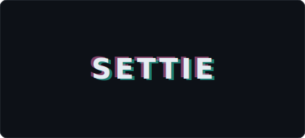

<table width="100%" border="0">
<tr valign="middle">
<td width="38%" align="center" valign="middle">

<!-- SETTIE wordmark (static SVG). Swap src for a GIF if you want motion later. -->

</td>
<td width="62%" valign="top">

<table border="0" width="100%">
<tbody>
<tr>
<td valign="middle" width="48"></td>
<td valign="middle">BS Computer Science @ University of Pittsburgh</td>
</tr>
<tr>
<td valign="middle"></td>
<td valign="middle">Service Desk + GIS/Applications Intern</td>
</tr>
<tr>
<td valign="middle"></td>
<td valign="middle">City of Pittsburgh — I&amp;P</td>
</tr>
<tr>
<td valign="middle"></td>
<td valign="middle">Settie LLC</td>
</tr>
</tbody>
</table>

  
  
  
  
  
  
  
  
  
  
  
  
  

</td>
</tr>
</table>

---

## ⏱️ Coding Activity

<!--START_SECTION:coding-stats-->
**2.9h** this week &nbsp;·&nbsp; 2/7 days active &nbsp;·&nbsp; 🔥 0 day streak

| Day | Time | |
|-----|------|---|
| Wed | 2h 15m | `████████████████` |
| Thu | 37m | `████░░░░░░░░░░░░` |

> Top project: **pittsjs** &nbsp;·&nbsp; Last updates on: **5/5/2026 7:08 PM EDT** · [code-clock](https://github.com/pittsjs/code-clock)
<!--END_SECTION:coding-stats-->

<strong>What I'm up to</strong>

<table width="100%" border="1" cellspacing="0" cellpadding="14">
<tr valign="top">
<td width="50%">

<strong>City of Pittsburgh — Department of Innovation & Performance</strong> <em>Service Desk + GIS/Applications Intern</em>

- **GIS / web apps**: Building an interactive onboarding tour for **[OneStopPGH Insights](https://experience.arcgis.com/experience/89d500285ecd4804ae9945d93d424569)** with Intro.js.
- **Service Desk**: Day-to-day support for internal staff — tickets, on-call support, troubleshooting, and coordination on hardware rollouts, including the citywide **Tech Refresh** (~**2,000** employees).
  - **2026 NFL Draft (Pittsburgh)**: 12 Hours of on-site IT support — standby coverage for **9+** city departments (Police, Fire, EMS, EMA, etc.) and partners at the **emergency operations center**, including the NFL, FBI, Homeland Security, ESPN, Verizon, AT&T, T-Mobile, FirstNet, **Allegheny** County, DOMI, and **counter-UAS (C-UAS)** teams.

</td>
<td width="50%">

<strong>Settie LLC</strong> — founder, engineer, developer

- web dev · AI software engineering · AI automation · social media content strategy · SEO · version control
- A solo startup I maintain from **end-to-end**; “full stack” in the entire *business* sense, not just the tech stack.

</td>
</tr>
</table>

<strong>Links</strong>

- [LinkedIn](https://www.linkedin.com/in/ssettie/)
- [BS Computer Science, University of Pittsburgh — coursework portfolio](https://pittsjs.github.io/Project-Portfolio-Samuel-Settie/)
- Personal website — *coming soon*

