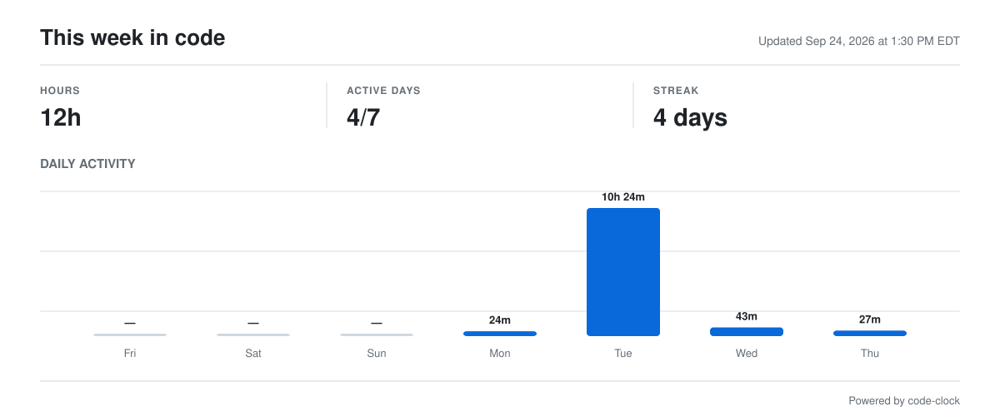

  
  

---

<!--START_SECTION:coding-stats-->
<a href="https://github.com/pittsjs/code-clock">
  <picture>
    <source media="(prefers-color-scheme: dark)" srcset="assets/code-clock-dark.svg">
    <source media="(prefers-color-scheme: light)" srcset="assets/code-clock-light.svg">
    
  </picture>
</a>
<!--END_SECTION:coding-stats-->

  
  
  
  
  
  
  
  
  
  
  
  
  

